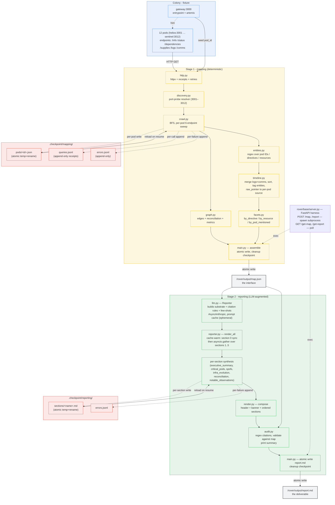

# Project Selene — Architecture

The system is two phases joined by a single artifact (`map.json`).
Stage 1 is deterministic; stage 2 is LLM-augmented but operates on
the substrate, not on the live HTTP surface.

## Component diagram

## Data flow at a glance

1. **Mapping** crawls the colony from one URL, port-probes new pod IDs,
   and persists per-pod JSON + every HTTP receipt + every error to a
   checkpoint as it goes. After the BFS frontier drains, derived data
   (entity tags → unified timeline → facet indexes → graph metrics with
   reconciliation) is computed in-memory and `map.json` is written
   atomically. Successful write triggers checkpoint cleanup.
2. **Reporting** opens `map.json`, builds a structured substrate (the
   long cached prefix), and runs six section calls — first synchronously
   to warm the prompt cache, then five in parallel via `asyncio.gather`.
   Each section is checkpointed independently; degraded sections fall
   back to deterministic templates with an error logged. After the
   final markdown is composed, the citation audit validates every
   `[t:N]` / `[d:…]` / `[e:…]` reference against the map and emits a
   summary. Successful write triggers checkpoint cleanup.

## Resume

Both phases can be killed mid-flight and restarted. On rerun, each
phase loads its checkpoint:

- Mapping skips any pod already in `.checkpoint/mapping/pods/`.
- Reporting reuses any section already in
  `.checkpoint/reporting/sections/`.
- HTTP receipts and error logs are append-only, so they survive across
  runs and end up complete in the final `map.json`.

## Storage layout in `map.json`

- `pods["<id>"]` — verbatim per-pod responses (the source of truth for
  raw payloads).
- `timeline[N]` — derived chronological view; each entry carries
  `text`, `entities`, and a `raw_pointer: {endpoint, index}` that
  dereferences back to `pods[source_pod].endpoints[endpoint]` to
  recover the original record without storing it twice.
- `edges[]` — `(supplier, consumer, resource)` triples with
  `claimed_by`, `criticality`, `log_evidence`, `status`.
- `graph_metrics` — degree, articulation points, transitive
  dependents, plus `unique_supplier_edges`, `critical_unique_edges`,
  `spof_pods` (the supply-level SPOF view).
- `facets` — inverted indexes over the timeline's entity tags.
- `queries[]`, `errors[]` — full HTTP receipt log + error log loaded
  from the checkpoint.
- `discovery_trace` — implicit in `pods[<id>].learned_from` +
  `resolution_query_ids`.
