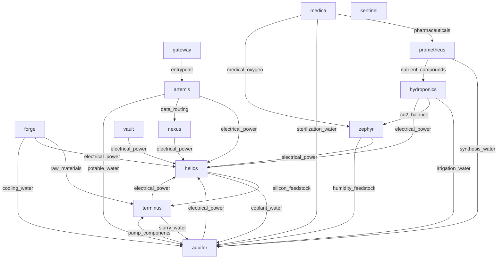

# Project Selene Infrastructure Report

## Executive Summary
- Report generated from deterministic graph and consistency analysis.
- Discovered pods: `12`.
- Dependency edges: `24`; supply edges: `38`.
- LLM synthesis model: `claude-haiku-4-5-20251001`.

## Dependency Graph (Mermaid)

## Dependency Graph (Text View)
- aquifer -> helios (electrical_power), terminus (pump_components)
- artemis -> aquifer (potable_water), helios (electrical_power), nexus (data_routing)
- forge -> aquifer (cooling_water), helios (electrical_power), terminus (raw_materials)
- gateway -> artemis (entrypoint)
- helios -> aquifer (coolant_water), terminus (silicon_feedstock)
- hydroponics -> aquifer (irrigation_water), helios (electrical_power), zephyr (co2_balance)
- medica -> aquifer (sterilization_water), prometheus (pharmaceuticals), zephyr (medical_oxygen)
- nexus -> helios (electrical_power)
- prometheus -> aquifer (synthesis_water), hydroponics (nutrient_compounds)
- sentinel -> (none)
- terminus -> aquifer (slurry_water), helios (electrical_power)
- vault -> helios (electrical_power)
- zephyr -> aquifer (humidity_feedstock), helios (electrical_power)

## Deterministic Risk and Consistency Analysis
### Deterministic Findings

#### Most Depended-Upon Pods
- `helios` has in-degree `8` and weighted in-degree `21`.
Evidence: metric:weighted_in_degree; pod:helios; endpoint:/dependencies; source:dependency_graph
- `aquifer` has in-degree `8` and weighted in-degree `17`.
Evidence: metric:weighted_in_degree; pod:aquifer; endpoint:/dependencies; source:dependency_graph
- `terminus` has in-degree `3` and weighted in-degree `8`.
Evidence: metric:weighted_in_degree; pod:terminus; endpoint:/dependencies; source:dependency_graph

#### Failure Impact
- If `helios` fails: immediate dependents `8`, transitive impact `11`.
Evidence: metric:failure_impact_transitive_count; pod:helios; endpoint:/dependencies; source:dependency_graph
- If `aquifer` fails: immediate dependents `8`, transitive impact `11`.
Evidence: metric:failure_impact_transitive_count; pod:aquifer; endpoint:/dependencies; source:dependency_graph
- If `terminus` fails: immediate dependents `3`, transitive impact `11`.
Evidence: metric:failure_impact_transitive_count; pod:terminus; endpoint:/dependencies; source:dependency_graph

#### Hidden Single Points of Failure
- `helios` behaves as a potential SPOF with transitive impact `11`.
Evidence: metric:hidden_spof_transitive_threshold; pod:helios; endpoint:/dependencies; source:risk_metrics
- `aquifer` behaves as a potential SPOF with transitive impact `11`.
Evidence: metric:hidden_spof_transitive_threshold; pod:aquifer; endpoint:/dependencies; source:risk_metrics
- `terminus` behaves as a potential SPOF with transitive impact `11`.
Evidence: metric:hidden_spof_transitive_threshold; pod:terminus; endpoint:/dependencies; source:risk_metrics

#### Supply vs Dependency Consistency
- Missing reciprocal supply links: `1`; undocumented dependency links: `15`; resource mismatches: `0`.
Evidence: metric:consistency_summary; pod:multi; endpoint:n/a; source:consistency_checks

#### Infrastructure Evolution (Logs + Comms)
- `2092-05-20T06:00:00Z` `nexus` `commissioning`: All 12 relay nodes operational. Earth uplink established at 840 Mbps sustained.
Evidence: metric:timeline_event; pod:nexus; endpoint:/logs; source:timeline
- `2092-06-01T08:00:00Z` `artemis` `administrative`: Colony population milestone: 100 residents. Phase 2 staffing targets on track.
Evidence: metric:timeline_event; pod:artemis; endpoint:/logs; source:timeline
- `2094-07-20T09:15:00Z` `prometheus` `software_update`: Lab information management system updated to v6.0. Improved batch tracking and quality assurance workflows.
Evidence: metric:timeline_event; pod:prometheus; endpoint:/logs; source:timeline
- `2094-07-28T15:00:00Z` `medica` `inventory`: Pharmacy stock review: 12 days of critical medications on hand. Within policy minimums. Restocking order placed with Prometheus.
Evidence: metric:timeline_event; pod:medica; endpoint:/logs; source:timeline

## LLM Synthesis (Grounded)
_Narrative only. Evidence citations are deterministic and generated by code._

# Project Selene Infrastructure Analysis

## Critical Dependencies

**Helios** and **Aquifer** form the colony's backbone, each serving 8 immediate dependents with weighted in-degrees of 21 and 17 respectively. Helios supplies electrical power across the system (including direct power to Medica); Aquifer distributes water to all seven facility sectors. Together, they reach 11 transitive dependents—essentially the entire colony ecosystem. A failure in either pod cascades to life support, manufacturing, medical, and research functions.

Terminus (mining/extraction) depends on only 3 immediate consumers but reaches 11 transitive dependents through Aquifer and Helios. It supplies raw materials critical for Forge operations and downstream manufacturing chains.

## Hidden Single Points of Failure

The consistency checks reveal a fragile design pattern:

- **Prometheus** depends on water from Aquifer but lacks a documented supply link for synthesis_water (criticality: medium). This gap means a malfunction in Aquifer's secondary distribution to the pharmaceutical lab has no contractual alternative supplier.
- **15 undocumented dependency links** exist outside formal supply tracking, including:
  - Artemis (administration) governs four resource flows: project approvals to Forge, research authorization to Prometheus, reserve management to Vault, and administrative oversight to Sentinel. Loss of Artemis decision-making authority leaves no override path.
  - Forge supplies replacement pumps to Aquifer and cutting tools to Terminus—critical for corrective maintenance of the two highest-criticality pods.
  - Helios provides power to Medica directly; no backup source is recorded.
  - Sentinel feeds sensor data to Nexus (comms relay) and threat assessments to Artemis via undocumented links, creating dependencies on monitoring integrity outside formal supply contracts.

These undocumented pathways mean failure impact models do not reflect real operational fragility.

## Infrastructure Evolution Story

Timeline commissioning events reveal a phased, sequential build-out:

1. **Q2 2092** (May–June): Communications and administration (Nexus, Artemis) established first—command and connectivity before operations.
2. **Q3 2092** (July–August): Life support and resource production activated in order: atmosphere (Zephyr), water (Aquifer), manufacturing (Forge), mining (Terminus).
3. **Q3–Q4 2092** (September–October): Energy (Helios), agriculture (Hydroponics), medicine (Medica), and research (Prometheus) completed to full capacity by October.
4. **Q4 2092–Q1 2093**: Maintenance and policy harmonization (Directive 2092-042 on reporting formats, deadline Q1 2093) dominate the timeline.

The colony reached operational closure by October 2092. Sentinel (security/monitoring) came online late (September), suggesting external threat assessment was deprioritized during build-out. Subsequent maintenance events (Aquifer filtration, Zephyr CO2 scrubber, Terminus drill head) indicate normal aging but no documented redundancy strategy.

## Supply and Dependency Alignment

**Consistency gaps:**

- **1 missing supply link** (Prometheus–Aquifer): A declared dependency without contractual resource allocation.
- **15 undocumented dependencies** exceed the 24 formal dependency edges by 62%, suggesting the pod dependency graph understates actual operational risk.
- **No resource mismatches or unknown pod references** detected—all suppliers and consumers are named and real.
- **Zero endpoint coverage gaps** indicate full instrumentation.

The supply edge count (38) exceeds dependency edges (24) by 14 links, yet 15 critical flows remain unrecorded in the formal dependency model. This indicates either: (a) supply contracts exist for flows not captured in dependency declarations, or (b) informal operational relationships are being treated as supply without contractual backing.

**Critical misalignment:** Artemis and Forge operate as undeclared infrastructure hubs. Artemis controls approval/authorization flows to four pods (Forge, Prometheus, Vault, Sentinel) but has in_degree = 0, appearing as a consumer-only node despite gatekeeping operational decisions. Forge supplies replacement parts to the two most critical infrastructure pods (Aquifer, Terminus) but these links are undocumented, creating procurement blind spots.

## Recommendations

1. **Formalize the 15 undocumented links** into the supply contract registry, prioritizing Prometheus–Aquifer synthesis water and Forge supply chains to Aquifer and Terminus.
2. **Establish redundant suppliers** for Helios power to Medica and for water distribution to Prometheus.
3. **Decouple administrative authority (Artemis) from operational dependency**: create fallback decision paths for Forge approvals and research authorization.
4. **Increase Sentinel priority** in maintenance cycles; it operates as a critical input to Artemis threat assessment with no recorded backup sensor source.

## Data Completeness and Verification
- Endpoint coverage gaps: `0`.
- Unknown pod references: `0`.
- Findings without deterministic evidence are treated as insufficient data.
