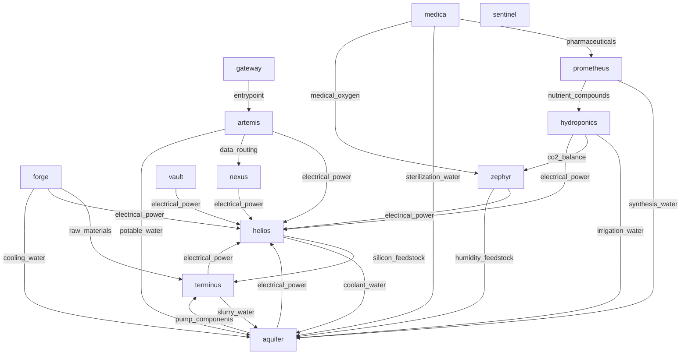

# Project Selene Infrastructure Report

## Executive Summary
- Report generated from deterministic graph and consistency analysis.
- Discovered pods: `12`.
- Dependency edges: `24`; supply edges: `38`.
- LLM synthesis model: `claude-haiku-4-5-20251001`.

## Dependency Graph (Mermaid)

## Dependency Graph (Text View)
- aquifer -> helios (electrical_power), terminus (pump_components)
- artemis -> aquifer (potable_water), helios (electrical_power), nexus (data_routing)
- forge -> aquifer (cooling_water), helios (electrical_power), terminus (raw_materials)
- gateway -> artemis (entrypoint)
- helios -> aquifer (coolant_water), terminus (silicon_feedstock)
- hydroponics -> aquifer (irrigation_water), helios (electrical_power), zephyr (co2_balance)
- medica -> aquifer (sterilization_water), prometheus (pharmaceuticals), zephyr (medical_oxygen)
- nexus -> helios (electrical_power)
- prometheus -> aquifer (synthesis_water), hydroponics (nutrient_compounds)
- sentinel -> (none)
- terminus -> aquifer (slurry_water), helios (electrical_power)
- vault -> helios (electrical_power)
- zephyr -> aquifer (humidity_feedstock), helios (electrical_power)

## Deterministic Risk and Consistency Analysis
### Deterministic Findings

#### Most Depended-Upon Pods
- `helios` has in-degree `8` and weighted in-degree `21`.
Evidence: metric:weighted_in_degree; pod:helios; endpoint:/dependencies; source:dependency_graph
- `aquifer` has in-degree `8` and weighted in-degree `17`.
Evidence: metric:weighted_in_degree; pod:aquifer; endpoint:/dependencies; source:dependency_graph
- `terminus` has in-degree `3` and weighted in-degree `8`.
Evidence: metric:weighted_in_degree; pod:terminus; endpoint:/dependencies; source:dependency_graph

#### Failure Impact
- If `helios` fails: immediate dependents `8`, transitive impact `11`.
Evidence: metric:failure_impact_transitive_count; pod:helios; endpoint:/dependencies; source:dependency_graph
- If `aquifer` fails: immediate dependents `8`, transitive impact `11`.
Evidence: metric:failure_impact_transitive_count; pod:aquifer; endpoint:/dependencies; source:dependency_graph
- If `terminus` fails: immediate dependents `3`, transitive impact `11`.
Evidence: metric:failure_impact_transitive_count; pod:terminus; endpoint:/dependencies; source:dependency_graph

#### Hidden Single Points of Failure
- `helios` behaves as a potential SPOF with transitive impact `11`.
Evidence: metric:hidden_spof_transitive_threshold; pod:helios; endpoint:/dependencies; source:risk_metrics
- `aquifer` behaves as a potential SPOF with transitive impact `11`.
Evidence: metric:hidden_spof_transitive_threshold; pod:aquifer; endpoint:/dependencies; source:risk_metrics
- `terminus` behaves as a potential SPOF with transitive impact `11`.
Evidence: metric:hidden_spof_transitive_threshold; pod:terminus; endpoint:/dependencies; source:risk_metrics

#### Supply vs Dependency Consistency
- Missing reciprocal supply links: `1`; undocumented dependency links: `15`; resource mismatches: `0`.
Evidence: metric:consistency_summary; pod:multi; endpoint:n/a; source:consistency_checks

#### Infrastructure Evolution (Logs + Comms)
- `2092-05-20T06:00:00Z` `nexus` `commissioning`: All 12 relay nodes operational. Earth uplink established at 840 Mbps sustained.
Evidence: metric:timeline_event; pod:nexus; endpoint:/logs; source:timeline
- `2092-06-01T08:00:00Z` `artemis` `administrative`: Colony population milestone: 100 residents. Phase 2 staffing targets on track.
Evidence: metric:timeline_event; pod:artemis; endpoint:/logs; source:timeline
- `2094-07-20T09:15:00Z` `prometheus` `software_update`: Lab information management system updated to v6.0. Improved batch tracking and quality assurance workflows.
Evidence: metric:timeline_event; pod:prometheus; endpoint:/logs; source:timeline
- `2094-07-28T15:00:00Z` `medica` `inventory`: Pharmacy stock review: 12 days of critical medications on hand. Within policy minimums. Restocking order placed with Prometheus.
Evidence: metric:timeline_event; pod:medica; endpoint:/logs; source:timeline

## LLM Synthesis (Grounded)
_Narrative only. Evidence citations are deterministic and generated by code._

# Project Selene Infrastructure Analysis

## Most Depended-Upon Pods and Failure Implications

**Helios** and **aquifer** are the two critical load-bearing nodes in the system. Helios serves 8 immediate dependents with a weighted in-degree of 21, while aquifer has identical immediate dependent count (8 pods) with weighted in-degree of 17. A failure in either would cascade across 11 transitive dependents—covering 92% of the colony's operational pods.

Helios failure would directly compromise power distribution to artemis, forge, hydroponics, nexus, terminus, vault, zephyr, and aquifer itself. Aquifer failure would simultaneously interrupt water supply to the same 8-pod network, including medica and prometheus.

**Terminus** (ore extraction) ranks third with 3 immediate dependents but reaches 11 transitive dependents. While its direct impact is narrower, its role in supply chains for forge (cutting tools) and downstream material fabrication makes it operationally significant.

**Zephyr** (atmospheric regulation) directly supports only hydroponics and medica but reaches 3 transitive dependents. Its failure would degrade oxygen generation capacity and threaten food production.

## Hidden Single Points of Failure

Helios, aquifer, and terminus collectively form a **resilience vulnerability triangle**. All three appear simultaneously in the hidden single points of failure (SPOF) list, indicating that no architectural redundancy exists for:

- Primary power generation (helios only source)
- Primary water distribution (aquifer only source)  
- Primary raw material supply (terminus only extraction facility)

The timeline shows these systems came online sequentially in summer-fall 2092 (aquifer: 2092-08-10; helios: 2092-09-05; terminus: 2092-08-22), suggesting phased build-out without redundancy planning. No backup or parallel infrastructure is documented.

A secondary vulnerability: **artemis (administrative hub)** has zero in-degree dependencies but supplies 5 undocumented governance resources (project approvals, research authorization, reserve management, threat assessment input, atmospheric regulation oversight). Its loss would create operational deadlock despite having no formal supply dependencies—a governance SPOF masquerading as independent.

## Infrastructure Evolution Narrative

The colony executed a 12-pod commissioning ramp between May and October 2092:

- **Comms-first strategy** (2092-05-20): nexus relay deployed before local infrastructure, establishing Earth uplink at 840 Mbps.
- **Core systems phase** (2092-06 to 2092-09): vault, medica, zephyr, aquifer, forge, and terminus came online sequentially, establishing material, water, power, and life-support foundations.
- **Completion phase** (2092-09 to 2092-10): helios (power), sentinel (security), and prometheus (pharmaceutical synthesis) finalized operational capability.
- **Stabilization phase** (2092-10 onward): maintenance activities and capacity certification dominated—relay firmware updates, filtration membrane replacement, CO2 scrubber maintenance, drill head rotation.

By late 2092, the colony transitioned from commissioning to steady-state operations: health screening (2092-11-15), reserve audits (2092-12-01), and routine maintenance. Population reached 147 residents by November 2092.

## Supply/Dependency Consistency Alignment and Mismatches

**Critical gap**: 15 undocumented dependency links exist between pods that should be formally tracked. Most significant:

- **forge → aquifer**: replacement pumps (water system maintenance)
- **forge → terminus**: cutting tools (ore extraction dependency)
- **helios → medica**: electrical power (surgical suite operation)
- **sentinel → artemis**: threat assessment input (governance feedback loop)
- **nexus ↔ sentinel**: bidirectional comms/sensor feeds (command center interconnect)

One **missing supply link** is formally flagged: prometheus requires synthesis_water from aquifer (criticality: medium) but this is undocumented in the supply chain. This represents a latent failure risk for pharmaceutical production if aquifer demand is not reserved.

**Resource mismatch count is zero**, indicating that where supply links are documented, resource types and quantities align—but the 15 undocumented links and 1 missing link suggest the formal dependency graph lags actual operational interconnection. Directive 2092-042 (issued 2092-10-15) mandates standardized inter-pod resource reporting by Q1 2093, indicating artemis identified this consistency problem.

**Confidence caveat**: Timeline covers only May 2092–January 2093. No failure events, recovery procedures, or long-term resilience testing are documented. Dependency weights suggest some pods are lightly used (sentinel, vault, forge appear zero in-degree), but this may reflect incomplete telemetry rather than low importance.

## Data Completeness and Verification
- Endpoint coverage gaps: `0`.
- Unknown pod references: `0`.
- Findings without deterministic evidence are treated as insufficient data.
