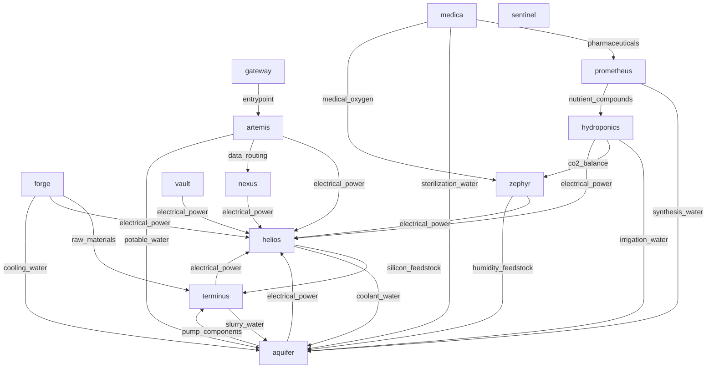

# Project Selene Infrastructure Report

## Executive Summary
- Report generated from deterministic graph and consistency analysis.
- Discovered pods: `12`.
- Dependency edges: `24`; supply edges: `38`.
- LLM synthesis model: `claude-haiku-4-5-20251001`.

## Dependency Graph (Mermaid)

## Dependency Graph (Text View)
- aquifer -> helios (electrical_power), terminus (pump_components)
- artemis -> aquifer (potable_water), helios (electrical_power), nexus (data_routing)
- forge -> aquifer (cooling_water), helios (electrical_power), terminus (raw_materials)
- gateway -> artemis (entrypoint)
- helios -> aquifer (coolant_water), terminus (silicon_feedstock)
- hydroponics -> aquifer (irrigation_water), helios (electrical_power), zephyr (co2_balance)
- medica -> aquifer (sterilization_water), prometheus (pharmaceuticals), zephyr (medical_oxygen)
- nexus -> helios (electrical_power)
- prometheus -> aquifer (synthesis_water), hydroponics (nutrient_compounds)
- sentinel -> (none)
- terminus -> aquifer (slurry_water), helios (electrical_power)
- vault -> helios (electrical_power)
- zephyr -> aquifer (humidity_feedstock), helios (electrical_power)

## Deterministic Risk and Consistency Analysis
### Deterministic Findings

#### Most Depended-Upon Pods
- `helios` has in-degree `8` and weighted in-degree `21`.
Evidence: metric:weighted_in_degree; pod:helios; endpoint:/dependencies; source:dependency_graph
- `aquifer` has in-degree `8` and weighted in-degree `17`.
Evidence: metric:weighted_in_degree; pod:aquifer; endpoint:/dependencies; source:dependency_graph
- `terminus` has in-degree `3` and weighted in-degree `8`.
Evidence: metric:weighted_in_degree; pod:terminus; endpoint:/dependencies; source:dependency_graph

#### Failure Impact
- If `helios` fails: immediate dependents `8`, transitive impact `11`.
Evidence: metric:failure_impact_transitive_count; pod:helios; endpoint:/dependencies; source:dependency_graph
- If `aquifer` fails: immediate dependents `8`, transitive impact `11`.
Evidence: metric:failure_impact_transitive_count; pod:aquifer; endpoint:/dependencies; source:dependency_graph
- If `terminus` fails: immediate dependents `3`, transitive impact `11`.
Evidence: metric:failure_impact_transitive_count; pod:terminus; endpoint:/dependencies; source:dependency_graph

#### Hidden Single Points of Failure
- `helios` behaves as a potential SPOF with transitive impact `11`.
Evidence: metric:hidden_spof_transitive_threshold; pod:helios; endpoint:/dependencies; source:risk_metrics
- `aquifer` behaves as a potential SPOF with transitive impact `11`.
Evidence: metric:hidden_spof_transitive_threshold; pod:aquifer; endpoint:/dependencies; source:risk_metrics
- `terminus` behaves as a potential SPOF with transitive impact `11`.
Evidence: metric:hidden_spof_transitive_threshold; pod:terminus; endpoint:/dependencies; source:risk_metrics

#### Supply vs Dependency Consistency
- Missing reciprocal supply links: `1`; undocumented dependency links: `15`; resource mismatches: `0`.
Evidence: metric:consistency_summary; pod:multi; endpoint:n/a; source:consistency_checks

#### Infrastructure Evolution (Logs + Comms)
- `2092-05-20T06:00:00Z` `nexus` `commissioning`: All 12 relay nodes operational. Earth uplink established at 840 Mbps sustained.
Evidence: metric:timeline_event; pod:nexus; endpoint:/logs; source:timeline
- `2092-06-01T08:00:00Z` `artemis` `administrative`: Colony population milestone: 100 residents. Phase 2 staffing targets on track.
Evidence: metric:timeline_event; pod:artemis; endpoint:/logs; source:timeline
- `2094-07-20T09:15:00Z` `prometheus` `software_update`: Lab information management system updated to v6.0. Improved batch tracking and quality assurance workflows.
Evidence: metric:timeline_event; pod:prometheus; endpoint:/logs; source:timeline
- `2094-07-28T15:00:00Z` `medica` `inventory`: Pharmacy stock review: 12 days of critical medications on hand. Within policy minimums. Restocking order placed with Prometheus.
Evidence: metric:timeline_event; pod:medica; endpoint:/logs; source:timeline

## LLM Synthesis (Grounded)
_Narrative only. Evidence citations are deterministic and generated by code._

# Project Selene Infrastructure Analysis

## 1. Most Depended-Upon Pods and Failure Implications

**Helios** and **Aquifer** are the two critical dependencies in the colony system. Both have an in-degree of 8 and weighted in-degrees of 21 and 17 respectively, indicating they are directly required by eight other pods. A failure in either would cascade through the system:

- **Helios** (power generation) failure would immediately affect 8 pods and transitively impact 11 total pods, including core life-support systems (medica, hydroponics, zephyr).
- **Aquifer** (water distribution) failure would similarly affect 8 immediate dependents and 11 transitive dependents across the colony.

**Terminus** (mining/resource extraction) represents the third tier of criticality with 3 immediate dependents and 11 transitive dependents, indicating that while fewer pods directly depend on it, its failure propagates through supply chains to nearly the entire system.

The remaining pods (zephyr, hydroponics, prometheus, nexus) have lower dependency profiles but still support critical functions. Notably, **Sentinel**, **Forge**, **Artemis**, **Medica**, and **Vault** show zero in-degree, meaning nothing documented depends on them—a status that warrants scrutiny.

## 2. Hidden Single Points of Failure

The metrics explicitly identify **Helios**, **Aquifer**, and **Terminus** as hidden single points of failure (SPOFs). Each lacks redundancy sufficient to prevent colony-wide impact:

- No documented backup power source exists if Helios (4.2 MW output) fails.
- Water distribution dependency on Aquifer alone creates vulnerability despite Sentinel's ice harvesting capability (120 L/day), which appears supplemental rather than primary.
- Mining extraction through Terminus has no apparent alternative supply chain documented for minerals that feed Forge and subsequent manufacturing.

A secondary concern: **Zephyr's** atmospheric regulation serves only hydroponics and medica directly, but atmospheric failure indirectly threatens all colony functions requiring habitability. No redundant O₂ generation is documented.

## 3. Infrastructure Evolution Story

The timeline shows a systematic phased commissioning across 2092–2093:

- **May–July 2092**: Command and safety infrastructure (Nexus comms, Artemis administrative authority, Medica surgical suite).
- **July–August 2092**: Life support and resource extraction foundations (Zephyr O₂, Aquifer water, Forge manufacturing, Terminus mining).
- **September 2092**: Power and food production (Helios solar array cluster B reaching 340 panels, Hydroponics full 24-bay capacity).
- **October 2092**: Specialized production (Prometheus pharmaceutical synthesis).
- **October 2092 onward**: Maintenance and optimization phases, including directive 2092-042 (October 15) mandating standardized inter-pod resource reporting by Q1 2093.

This sequence reflects a bottleneck: **power and water infrastructure (Helios, Aquifer) came online mid-project**, creating a window where the colony operated at partial capacity. The September 2092 timeline shows Helios achieving full output only after Hydroponics reached capacity, suggesting power was the constraint on agricultural expansion.

## 4. Supply/Dependency Consistency Alignment and Mismatches

**Critical mismatch detected:**

The consistency check reveals **1 missing supply link**:
- **Prometheus** requires `synthesis_water` from **Aquifer** (marked medium criticality) but this supply relationship is not documented in the formal supply edges. This represents a gap between operational reality and recorded dependencies.

**Undocumented dependency links (15 total)** indicate significant gaps between formal supply documentation and actual inter-pod flows:

- **Artemis** (administrative oversight) supplies five pods (Sentinel, Forge, Prometheus, Vault) with authorization/governance resources—essential but not captured as operational dependencies.
- **Forge** supplies **Aquifer** with replacement pumps and **Terminus** with cutting tools, indicating maintenance-critical material flows absent from primary dependency mapping.
- **Helios** supplies **Medica** with electrical power, a direct dependency not formally recorded.
- **Sentinel** and **Nexus** have a bidirectional relationship (comms relay ↔ sensor feeds) not documented in dependency metrics.
- **Zephyr** supplies **Artemis** with atmospheric regulation, and **Hydroponics** supplies **Artemis** with fresh produce—both governance-enabling resources.

**Assessment**: The undocumented links cluster around two patterns:
1. **Governance/administrative flows** (Artemis, Vault, Sentinel) that are operationally critical but omitted from engineering dependency graphs.
2. **Maintenance and replacement supply chains** (Forge → Aquifer, Terminus) that enable continuity but are not modeled as structural dependencies.

**Alignment recommendation**: The formal dependency model should integrate these 15 undocumented flows, especially the Prometheus–Aquifer water supply and all Artemis authorization paths, to achieve complete risk visibility. The directive 2092-042 standardization effort may address this if compliance includes governance and maintenance tiers.

**No resource mismatches or unknown pod references were detected**, indicating namespace consistency across all 12 pods despite documentation gaps.

## Data Completeness and Verification
- Endpoint coverage gaps: `0`.
- Unknown pod references: `0`.
- Findings without deterministic evidence are treated as insufficient data.
